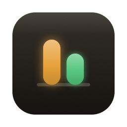
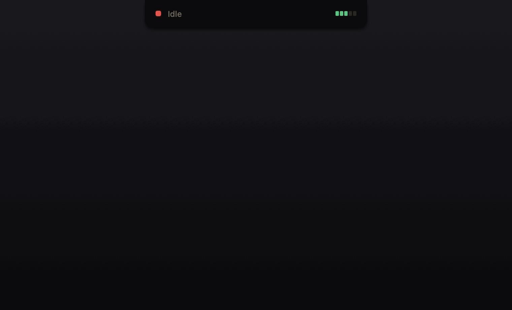

<div align="center">



# AndonCord

**Claude Code & Codex sessions on your Mac's notch.**
Approve tool calls, answer questions, and review plans — without leaving your editor.


<br>



<sub>Claude Code (CC) and Codex (CX) running side by side on the board — then Codex pulls the cord and you approve, in the notch.</sub>

</div>

---

On a Toyota production line, any worker can pull the **andon cord** to stop the
line and call for help — and a board above the floor shows every station's
status at a glance. That is exactly what this app is: Claude Code pulls the
cord when it needs you, the board in your notch lights up, you answer, the
line resumes.

**Claude Code and Codex**, integrated deeply rather than broadly. Both expose
almost the same hook contract — the same event names, the same stdin-JSON, the
same decision format — so AndonCord speaks to each one natively: the permission
card shows a real diff, questions get answered from the notch instead of just
announced, and a mixed board tells the two apart at a glance (`CC` for Claude
Code, `CX` for Codex). Deep beats broad — one shim, one socket, two agents.

## What it does

| | |
|---|---|
| 🖥️ **Watch** | Every session's live state — a bouncing equalizer while working, amber blink when it needs you, red when stopped. Elapsed time ticks in real time. |
| ✅ **Answer** | Approve or deny tool calls (with the actual diff or command in front of you), answer `AskUserQuestion` prompts, review and revise plans — all from the notch. |
| 🎯 **Jump** | Click a session to land in its exact terminal tab, split, or tmux pane. |
| 📊 **Budget** | 5-hour and weekly rate-limit windows, read from Claude Code itself — the same numbers `/usage` shows, not token-count guesswork. |
| 🔊 **Hear** | Synthesized 8-bit cues, one per event, distinct enough to learn by ear. Replace any of them by dropping a `.wav` into `~/.andoncord/sounds`. |

Everything is local. No account, no server, no telemetry, no network calls.

## The lamp language

The board reads like an andon board — colour and motion first, text second:

| Lamp | Meaning |
|---|---|
| 🟢 bouncing equalizer + ticking timer | the line is moving — the agent is working |
| 🟠 hard blink + `CORD` badge | cord pulled — a decision is waiting on you |
| 🔴 steady dot | stopped — idle, finished, or failed |

Each session also carries a tinted agent badge — `CC` (Claude Code) or `CX`
(Codex) — so a board with both agents running never leaves you guessing which
one just pulled the cord.

If it's green and moving, it's working. If it's red and still, it isn't.
There is no state where a dead session can impersonate a live one: sessions
whose process disappears are reaped by a real pid liveness check, not a timer.

## Install

```bash
git clone https://github.com/MuratKaragozgil/andoncord.git
cd andoncord
./build.sh release
cp -R "build/AndonCord.app" /Applications/
open /Applications/AndonCord.app
```

First launch walks you through Claude Code setup, and **Settings** has a Codex
row you can enable separately. With your consent AndonCord will:

- **Claude Code** — add hook entries to `~/.claude/settings.json`, **alongside**
  anything already there, and point `statusLine` at a wrapper that **chains to
  your existing statusline** so its output keeps rendering
- **Codex** — add hooks to `~/.codex/hooks.json`, a file that is separate from
  `config.toml` and additive by design, so your existing Codex config and
  `notify` command are left untouched
- create `~/.andoncord/` for the local socket, the hook launcher, and a
  timestamped backup taken before every change

Each integration is independent — run one, the other, or both. **Settings →
Remove** puts each file back exactly as it was; only entries carrying our marker
are touched. Already-running sessions need a restart before hooks apply.

> **Codex note:** hooks are a recent, sometimes-gated Codex feature. If Codex
> sessions don't appear, enable it with `[features] hooks = true` in
> `~/.codex/config.toml` — the Settings row detects this and tells you.

> Builds are ad-hoc signed. On a machine other than the one that built it,
> Gatekeeper will complain — right-click → Open, or build it yourself.

## How it works

```
Claude Code ┐
            ├─spawns─▶ andon-hook ──unix socket──▶ AndonCord.app
Codex       ┘        (--source tags     one socket, (the board)
   (hooks)            the agent)        both agents
      ▲                                                   │
      └──────────── decision JSON on stdout ◀─────────────┘
```

Both agents run the **same shim** over the **same socket**; a `--source`
argument written into each hook command is all that distinguishes them. Because
Claude Code and Codex share the hook payload shape and the decision format, the
board, the request cards, and the approval round trip are entirely
agent-agnostic — adding Codex was a matter of *where* the hooks install, not
*how* they are handled.

**The shim is a real process, not an HTTP callback — deliberately.** Claude
Code spawns it as a child of your shell, so it inherits the controlling TTY and
the terminal's environment variables. That is the only reliable way to learn
*which tab* a session lives in; the hook payload itself carries no terminal
information at all.

**Approval works by blocking.** `PermissionRequest` hooks are registered with a
24-hour timeout. The shim writes the request to the socket and blocks on
`read()` — Claude Code is genuinely paused. When you click **Allow**, the
decision travels back down the same connection, the shim prints it to stdout,
and the turn resumes.

**Questions and plans ride the deny + reason channel.** A `PreToolUse` hook
cannot return a tool result, but Claude Code feeds `permissionDecisionReason`
back to the model. So answering a question is expressed as a denial whose
reason is *"The user answered: Staging"* — the answer lands as ordinary tool
feedback. No keystrokes injected into your terminal, no dependence on the TUI's
internals.

**Quota comes from the statusline.** `rate_limits` is exposed on Claude Code's
statusline payload and nowhere else. Since only one statusline can be
configured, AndonCord takes it over and chains to whatever was there before,
passing the identical stdin. Uninstall restores the original entry verbatim.

### Failing open

The shim sits on your critical path, so every failure path exits `0` with no
output — which Claude Code reads as "the hook had no opinion":

- app not running → exit 0, Claude Code carries on
- app dies mid-decision → hook released, Claude Code falls back to its own prompt
- session closed while a request is parked → hook released immediately

The worst case is that AndonCord becomes invisible. It never breaks Claude Code.

### The notch panel

The panel window never moves or resizes — only its contents animate. An earlier
version resized the window on hover, which oscillates: the resize moves the
boundary that decides whether the pointer is inside, which flips hover, which
resizes again. With a fixed window and an `interactiveRect`-based hit test,
clicks outside the drawn region fall through to whatever is behind, and the
feedback loop is structurally impossible.

## Project layout

```
Sources/
  AndonKit/            # models, socket, installer, store — no AppKit
    Server/            # HookServer, SocketTransport, PendingDecision
    Integration/       # ClaudeSettingsInstaller, CodexHooksInstaller, JSONC
    Store/             # BoardStore — the state machine + session reaper
    Audio/             # ChiptuneEngine — synthesized 8-bit cues
  andon-hook/          # the shim: tiny, fail-open, terminal-aware
  AndonCordApp/        # SwiftUI + AppKit
    Notch/             # fixed-size panel, pill, board, request cards
    Terminal/          # precise jump (AppleScript / CLI / tmux)
Tools/make-icon.swift      # the app icon, generated from the theme palette
Tools/make-demo-gif.swift  # the README demo, rendered from the same palette + geometry
```

> The demo above is rendered offscreen from the app's own palette, geometry, and
> equalizer math — not a live screen capture — so it shows exactly what the app
> draws. Regenerate it with `swift Tools/make-demo-gif.swift docs/demo.gif`.

`AndonKit` deliberately avoids AppKit so the shim stays light — it is spawned
on every tool call (~10 ms). The icon is code, not an asset, so it can never
drift from the palette the board uses.

## Development

```bash
swift build --product andon-hook   # RoundTripTests spawn the real shim
swift test                         # 58 tests
```

The tests that matter most:

- **RoundTripTests** — run the actual `andon-hook` binary as a subprocess over
  a real Unix socket and assert on what it prints to stdout, which is the only
  thing Claude Code ever reads. Covers the approval round trip,
  release-on-session-end, fail-open, and hot-path latency.
- **InstallerTests / CodexInstallerTests** — coexistence with other tools'
  hooks in both `settings.json` and `hooks.json`, byte-exact statusline
  restoration, idempotent reinstall, drift detection, and Codex feature-flag
  detection. A round-trip test confirms a `--source codex` hook tags its
  session as Codex while a Claude hook on the same socket stays Claude.
- **BoardStoreTests / ReapingTests** — every code path releases its parked
  hook (a leak here is someone's hung session), and dead sessions are reaped
  by pid liveness while parked requests are never swept.

Debugging: launch with `ANDON_DEBUG=1` and tail `~/.andoncord/debug.log` —
hover and presentation transitions are logged, so a misbehaving panel shows up
as text instead of guesswork.

## Known limits

- **Precise jump** works for iTerm2, Terminal.app, WezTerm, kitty (remote
  control on), and tmux. Ghostty, Warp, Alacritty, Hyper, Zed, and editor
  terminals only get app activation — they expose no public tab-addressing
  API, and the UI says "Click to raise" instead of pretending.
- Sessions hosted by the **Claude desktop app** have no terminal at all; they
  are identified by the launching bundle and a click raises Claude.
- **Quota needs an interactive session** — `claude -p` never renders a
  statusline, so the usage strip stays empty until you run `claude` in a
  terminal. (Codex quota is not surfaced; there is no equivalent statusline.)
- **Codex hooks are version-gated** — the feature is recent and, on some
  builds, off by default. AndonCord installs the hooks and detects the flag,
  but cannot flip it for you.
- First precise jump prompts for **Automation** permission (iTerm2 /
  Terminal.app only). Denying it degrades to app activation.
- No SSH-remote sessions, no auto-update, ad-hoc signing only.

## Credits

Inspired by [Vibe Island](https://vibeisland.app), which supports 26 agents.
AndonCord is the opposite bet: a small, deliberately chosen set of agents —
Claude Code and Codex — integrated as deeply as their hooks allow, rather than
many wired up shallowly. Built with
[Claude Code](https://claude.com/claude-code) — one of the tools it watches.
