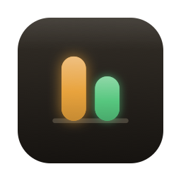

<div align="center">



# AndonCord

**Claude Code, Codex, Gemini CLI & Cursor sessions on your Mac's notch.**
Approve tool calls, answer questions, and review plans — without leaving your editor.


[](https://github.com/MuratKaragozgil/andoncord/releases/latest)

**[⬇ Download AndonCord.dmg](https://github.com/MuratKaragozgil/andoncord/releases/latest/download/AndonCord.dmg)** — universal (Apple Silicon + Intel), macOS 14+

<br>


<sub>Four agents on one board with live quota — then Cursor's shell gate pulls the cord: Deny, Allow, or hand it back with "Ask in Cursor".</sub>

</div>

---

On a Toyota production line, any worker can pull the **andon cord** to stop the
line and call for help — and a board above the floor shows every station's
status at a glance. That is exactly what this app is: Claude Code pulls the
cord when it needs you, the board in your notch lights up, you answer, the
line resumes.

Integrated deeply rather than broadly — each agent added only as far as its
hook contract honestly allows, and the UI never pretends otherwise:

| | Agent | Watch | Answer from the notch | Hooks live in |
|---|---|---|---|---|
|  | **Claude Code** | ✓ | ✓ permissions · questions · plan review | `~/.claude/settings.json` |
|  | **Codex** | ✓ | ✓ permissions | `~/.codex/hooks.json` |
|  | **Gemini CLI** | ✓ | alert + jump — Gemini hooks can announce an approval but not answer it | `~/.gemini/settings.json` |
|  | **Cursor** | ✓ | opt-in shell gate: Allow · Deny · Ask in Cursor | `~/.cursor/hooks.json` |

One shim, one socket, one board; a `--source` tag per hook command is all that
tells the agents apart. Claude Code and Codex share the decision format, so
approvals round-trip from the notch. Gemini's `Notification` hook fires when a
dialog appears but is fire-and-forget by design, so there the board alerts you
and precise jump takes you to the terminal to decide. Cursor has no "approval
needed" event at all — instead its `beforeShellExecution` hook *is* the
approval — so AndonCord watches by default and offers an opt-in gate that
parks every shell command in the notch, with **Ask in Cursor** as the
hand-back-to-native escape hatch.

## What it does

| | |
|---|---|
| 🖥️ **Watch** | Every session's live state — a bouncing equalizer while working, amber blink when it needs you, red when stopped. Elapsed time ticks in real time. |
| ✅ **Answer** | Approve or deny tool calls (with the actual diff or command in front of you), answer `AskUserQuestion` prompts, review and revise plans — all from the notch. |
| 🎯 **Jump** | Click a session to land in its exact terminal tab, split, or tmux pane. |
| 📊 **Budget** | 5-hour and weekly rate-limit windows, read from Claude Code itself — and a straight answer to the question a percentage can't give you on its own: *will it last?* |
| 🧾 **Account** | Where the tokens actually went — by project, by session, by prompt, by file. Read from Claude Code's own transcripts, which record every request and add up none of it. |
| 🔊 **Hear** | Synthesized 8-bit cues, one per event, distinct enough to learn by ear. Replace any of them by dropping a `.wav` into `~/.andoncord/sounds`. |
| 📺 **Place** | The board lives on the display you choose — the notched built-in screen or any external monitor (Settings → Display). |

Everything is local. No account, no server, no telemetry, no network calls.

## Will it last?

A quota percentage on its own is unreadable. 60% used is comfortable four
hours into a five-hour window and a wall you hit before lunch twenty minutes
in. These windows are fixed-length, so their reset time gives away when they
opened — and from that, AndonCord projects where the current pace lands:

> **5H · 47% used, resets in 2h38m** — session runs out 16:12 at this pace

Getting a *current* percentage is the harder half. Claude Code publishes
`rate_limits` on exactly one surface — the statusline — and a statusline only
renders while a session is drawing one. Work through the desktop app, an SDK
session, or a headless run and that reading never updates at all; close every
terminal and it stops the moment you do.

So AndonCord reads whichever source is actually alive, in this order:

1. **`~/Library/Application Support/Claude/plan-usage-history.json`** — the
   Claude desktop app's own record, written every five minutes with the same
   two percentages its Usage panel shows, and carrying a month of history.
   Read-only; nothing is written back.
2. **Claude Code's statusline**, for machines without the desktop app.
3. **The transcripts**, when both have gone quiet — one real reading fixes the
   scale between measured spend and a percentage, and the ledger carries it
   from there.

Neither source records when a window *opened*, which is what the forecast
needs. The history does, implicitly: a reset is the percentage falling, and
consecutive samples bracket the moment it happened.

```
13:29   5h  30%     ← still the old window
13:44   5h   1%     ← new one, so it turned over in between
```

The weekly window resets on a fixed cadence, so every reset ever recorded
constrains the same phase and the tightest bracket across a month pins it to
within a few minutes.

And a figure is never presented as current when it isn't:

- a window whose reset time has passed is not drawn at all — that reading is
  about a window which no longer exists
- a reading Claude Code gave is shown plainly; anything AndonCord worked out
  itself is marked `~` and says so on hover
- between readings, the gap is filled from the transcripts. One honest reading
  — "you are 40% through this window" — next to the spend that produced it
  fixes the scale, and after that the ledger carries it forward on its own

## Where the tokens went

**Menu bar → Token Usage**, click the quota strip on the board, or
`open -a AndonCord --args --usage` if you would rather put it on a shortcut.

Claude Code writes every request it makes to
`~/.claude/projects/<cwd>/<session>.jsonl`, `usage` block attached, and adds up
none of it. AndonCord indexes those files and answers the four questions that
follow from a quota running low:

| | |
|---|---|
| **Projects** | which repo is eating the week |
| **Sessions** | which conversation inside it, largest first |
| **Prompts** | what one thing you typed set in motion — its replies, its tool calls, its retries |
| **Context** | which files and commands are actually carrying the cost |

That last one is the least obvious and usually the answer. A 40k-token file
read on turn 3 of a 60-turn session is re-sent as a cache read on all 57
requests that follow, so it is charged nearly sixty times over. The Context
list separates *direct* (the result itself) from *re-sent* (the same result
travelling again on every later request), and the second column is normally the
larger one.

Two details decide whether these numbers are true, and both are easy to get
wrong: Claude Code writes one line per content block and repeats the identical
`usage` object on every one of them — counting per line inflates every total by
roughly 3× — and dollar figures are a *cost-equivalent*, what the same traffic
would cost at API list prices, since a subscription is not billed per token at
all.

The index is built once, cached in `~/.andoncord/usage-index.json`, and only
re-reads files that changed. Nothing leaves the machine; the transcripts are
opened read-only and never modified.

## The lamp language

The board reads like an andon board — colour and motion first, text second:

| Lamp | Meaning |
|---|---|
| 🟢 bouncing equalizer + ticking timer | the line is moving — the agent is working |
| 🟠 hard blink + `CORD` badge | cord pulled — a decision is waiting on you |
| 🔴 steady dot | stopped — idle, finished, or failed |

Each session also wears its agent's mark — Claude's starburst, the OpenAI
knot, Gemini's spark, Cursor's cube — tinted per agent, so a mixed board never
leaves you guessing who just pulled the cord.

If it's green and moving, it's working. If it's red and still, it isn't.
There is no state where a dead session can impersonate a live one: sessions
whose process disappears are reaped by a real pid liveness check, not a timer.

## Install

**[⬇ Download AndonCord.dmg](https://github.com/MuratKaragozgil/andoncord/releases/latest/download/AndonCord.dmg)**,
open it, drag AndonCord into Applications, launch. Releases are Developer ID
signed and notarised by Apple, so it opens with a plain double-click.

Or build from source:

```bash
git clone https://github.com/MuratKaragozgil/andoncord.git
cd andoncord
./build.sh release
cp -R "build/AndonCord.app" /Applications/
open /Applications/AndonCord.app
```

First launch walks you through Claude Code setup; **Settings** has separate
rows for Codex and Gemini CLI. With your consent AndonCord will:

- **Claude Code** — add hook entries to `~/.claude/settings.json`, **alongside**
  anything already there, and point `statusLine` at a wrapper that **chains to
  your existing statusline** so its output keeps rendering
- **Codex** — add hooks to `~/.codex/hooks.json`, a file that is separate from
  `config.toml` and additive by design, so your existing Codex config and
  `notify` command are left untouched
- **Gemini CLI** — add named hooks to `~/.gemini/settings.json` using Gemini's
  own event vocabulary (`BeforeTool`, `AfterAgent`, …); event arrays merge
  additively across scopes, and the entries show up by name in `/hooks`
- **Cursor** — add entries to `~/.cursor/hooks.json` (flat schema, hot-reloaded
  by Cursor); the shell gate is a separate toggle that rewrites the file live
- create `~/.andoncord/` for the local socket, the hook launcher, and a
  timestamped backup taken before every change

Each integration is independent — enable any combination. **Settings →
Remove** puts each file back exactly as it was; only entries carrying our marker
are touched. Already-running sessions need a restart before hooks apply.

> **Codex note:** hooks are a recent, sometimes-gated Codex feature. If Codex
> sessions don't appear, enable it with `[features] hooks = true` in
> `~/.codex/config.toml` — the Settings row detects this and tells you.

## How it works

```
Claude Code ┐
Codex       ├─spawns─▶ andon-hook ──unix socket──▶ AndonCord.app
Gemini CLI  ┘        (--source tags     one socket,  (the board)
   (hooks)            the agent)        every agent
      ▲                                                   │
      └──────────── decision JSON on stdout ◀─────────────┘
```

Every agent runs the **same shim** over the **same socket**; a `--source`
argument written into each hook command is all that distinguishes them. Gemini
renamed the events (`BeforeTool`, `AfterAgent`, …) but kept Claude's structure,
so a small normalisation table in `HookEventName` is the entire cost of
understanding its dialect — the board, cards, and approval round trip stay
agent-agnostic.

**The shim is a real process, not an HTTP callback — deliberately.** Claude
Code spawns it as a child of your shell, so it inherits the controlling TTY and
the terminal's environment variables. That is the only reliable way to learn
*which tab* a session lives in; the hook payload itself carries no terminal
information at all.

**Approval works by blocking.** `PermissionRequest` hooks are registered with a
24-hour timeout. The shim writes the request to the socket and blocks on
`read()` — Claude Code is genuinely paused. When you click **Allow**, the
decision travels back down the same connection, the shim prints it to stdout,
and the turn resumes.

**Questions and plans ride the deny + reason channel.** A `PreToolUse` hook
cannot return a tool result, but Claude Code feeds `permissionDecisionReason`
back to the model. So answering a question is expressed as a denial whose
reason is *"The user answered: Staging"* — the answer lands as ordinary tool
feedback. No keystrokes injected into your terminal, no dependence on the TUI's
internals.

**Quota comes from the statusline.** `rate_limits` is exposed on Claude Code's
statusline payload and nowhere else. Since only one statusline can be
configured, AndonCord takes it over and chains to whatever was there before,
passing the identical stdin. Uninstall restores the original entry verbatim.

### Failing open

The shim sits on your critical path, so every failure path exits `0` with no
output — which Claude Code reads as "the hook had no opinion":

- app not running → exit 0, Claude Code carries on
- app dies mid-decision → hook released, Claude Code falls back to its own prompt
- session closed while a request is parked → hook released immediately

The worst case is that AndonCord becomes invisible. It never breaks Claude Code.

### The notch panel

The panel window never moves or resizes — only its contents animate. An earlier
version resized the window on hover, which oscillates: the resize moves the
boundary that decides whether the pointer is inside, which flips hover, which
resizes again. With a fixed window and an `interactiveRect`-based hit test,
clicks outside the drawn region fall through to whatever is behind, and the
feedback loop is structurally impossible.

## Project layout

```
Sources/
  AndonKit/            # models, socket, installer, store — no AppKit
    Server/            # HookServer, SocketTransport, PendingDecision
    Integration/       # Claude/Codex/Gemini installers, LauncherWriter, JSONC
    Store/             # BoardStore — the state machine + session reaper
    Audio/             # ChiptuneEngine — synthesized 8-bit cues
  andon-hook/          # the shim: tiny, fail-open, terminal-aware
  AndonCordApp/        # SwiftUI + AppKit
    Notch/             # fixed-size panel, pill, board, request cards
    Terminal/          # precise jump (AppleScript / CLI / tmux)
Tools/make-icon.swift      # the app icon, generated from the theme palette
Tools/make-demo-gif.sh     # the README demo, rendered from the same palette + geometry
```

> The demo above is rendered offscreen from the app's own palette, geometry, and
> equalizer math — not a live screen capture — so it shows exactly what the app
> draws. Regenerate it with `Tools/make-demo-gif.sh docs/demo.gif`.

`AndonKit` deliberately avoids AppKit so the shim stays light — it is spawned
on every tool call (~10 ms). The icon is code, not an asset, so it can never
drift from the palette the board uses.

## Development

```bash
swift build --product andon-hook   # RoundTripTests spawn the real shim
swift test                         # 93 tests
./build.sh dmg                     # the release artifact: a universal drag-to-install image
```

The tests that matter most:

- **RoundTripTests** — run the actual `andon-hook` binary as a subprocess over
  a real Unix socket and assert on what it prints to stdout, which is the only
  thing Claude Code ever reads. Covers the approval round trip,
  release-on-session-end, fail-open, and hot-path latency.
- **InstallerTests / CodexInstallerTests** — coexistence with other tools'
  hooks in both `settings.json` and `hooks.json`, byte-exact statusline
  restoration, idempotent reinstall, drift detection, and Codex feature-flag
  detection. A round-trip test confirms a `--source codex` hook tags its
  session as Codex while a Claude hook on the same socket stays Claude.
- **BoardStoreTests / ReapingTests** — every code path releases its parked
  hook (a leak here is someone's hung session), and dead sessions are reaped
  by pid liveness while parked requests are never swept.

Debugging: launch with `ANDON_DEBUG=1` and tail `~/.andoncord/debug.log` —
hover and presentation transitions are logged, so a misbehaving panel shows up
as text instead of guesswork.

## Known limits

- **Precise jump** works for iTerm2, Terminal.app, WezTerm, kitty (remote
  control on), and tmux. Ghostty, Warp, Alacritty, Hyper, Zed, and editor
  terminals only get app activation — they expose no public tab-addressing
  API, and the UI says "Click to raise" instead of pretending.
- Sessions hosted by the **Claude desktop app** have no terminal at all; they
  are identified by the launching bundle and a click raises Claude.
- **Quota needs an interactive session** — `claude -p` never renders a
  statusline, so the usage strip stays empty until you run `claude` in a
  terminal. (Codex quota is not surfaced; there is no equivalent statusline.)
- **Codex hooks are version-gated** — the feature is recent and, on some
  builds, off by default. AndonCord installs the hooks and detects the flag,
  but cannot flip it for you.
- **Gemini is watch-only** — its hooks cannot answer approvals (`Notification`
  is fire-and-forget and `BeforeTool` runs post-approval), so the board
  alerts and jumps instead of showing Allow/Deny. Requires Gemini CLI ≥ 0.26.
- **Cursor's gate gates everything** — `beforeShellExecution` fires for every
  shell command, allowlisted ones included, and a hook decision bypasses
  Cursor's own approval UI. That is why the gate is opt-in. Requires a 2026
  `cursor-agent` (older CLIs never fire hooks — run `cursor-agent update`).
  Cursor's CLI also runs Claude-format hooks from `settings.json`; AndonCord
  detects `cursor_version` in those payloads and folds the double-fire into
  one correctly-badged session.
- First precise jump prompts for **Automation** permission (iTerm2 /
  Terminal.app only). Denying it degrades to app activation.
- No SSH-remote sessions, no auto-update.

## Credits

Inspired by [Vibe Island](https://vibeisland.app), which supports 26 agents.
Agent marks are drawn from [Simple Icons](https://simpleicons.org) path data
(CC0); the logos remain trademarks of their respective owners.
AndonCord is the opposite bet: a small, deliberately chosen set of agents —
Claude Code, Codex, Gemini CLI, and Cursor — each integrated exactly as deeply
as its hooks allow, rather than many wired up shallowly. Built with
[Claude Code](https://claude.com/claude-code) — one of the tools it watches.
